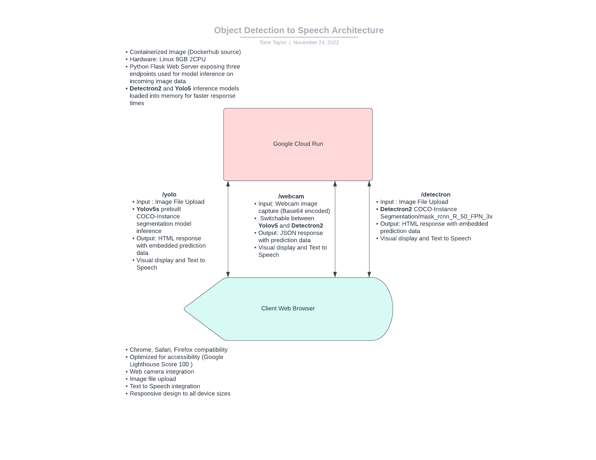

# Object Detection API using Flask and Object Detection Libraries

## Docker (preferred)

### with Docker Compose

```sh
docker-compose up --build
```

### or CLI commands

```sh
# Build
docker build -t object-detection .
# Run
docker run -e PORT=8080 -p 8080:8080 object-detection:latest

```

then visit http://localhost:8080/ in your browser:

### Test

Good for testing models without restarting/relying on Flask server.

1. Run Docker container using steps above
2. In new command line window run

```sh
   docker container ls # (get running docker container name)
   docker exec [running docker container name] python3 tests/[test file name]
```

## Run & Develop with Local Python Environment (alternative to Docker)

```sh
python3 -m venv venv
source venv/bin/activate
(venv) $ pip install -r requirements.txt
(venv) $ python3 webapp.py --port 8080
```

then visit http://localhost:8080/ in your browser:

## Google Cloud Run

[Live Web Application](https://object-detection-qq4ppihdsa-uc.a.run.app/)

```sh
gcloud services enable containerregistry.googleapis.com
docker pull <docker-id>/<image-name>
docker tag <docker-id>/<image-name> gcr.io/<project-id>/<image-name>
docker push gcr.io/<project-id>/<image-name>
```

## Architecture



## Google Colab
https://colab.research.google.com/drive/1dBh5onisO2XdNzwVmCosnYGTca_eFaVW?usp=sharing

## Reference

- https://github.com/ultralytics/yolov5
- https://github.com/ultralytics/yolov5/issues/36
- https://detectron2.readthedocs.io/en/latest/tutorials/getting_started.html
- https://github.com/robmarkcole/yolov5-flask (this repo was forked from here)
